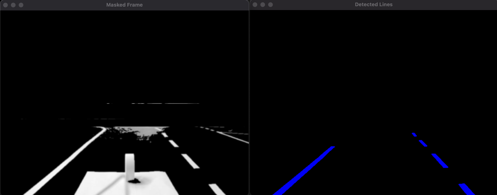

## Road Lane Detection Tool

This project provides a straightforward solution for detecting road lanes from a camera stream. By adjusting parameters such as lane width and line thickness, users can enhance lane visibility and minimize visual interference from other elements in the scene.

By changing the following you can adjust the line thickness and lane width of the filter.
```
int min_pixel_count_line = 7;
int max_pixel_count_line = 25;

int min_pixel_count_track_width = 400;
int max_pixel_count_track_width = 500;
```

# Getting Started

Clone the repository.
Set up the required dependencies.

```
mkdir build
cd build cmake ../
make 
./CameraProcessorApp
```

# Requirements

Camera input (USB or other compatible sources)
OpenCV
